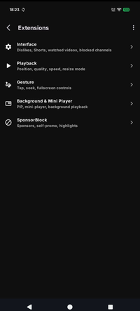
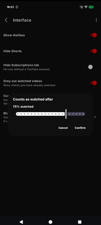
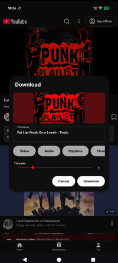
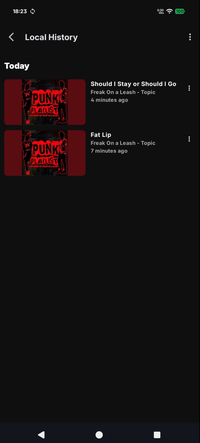

YuTbe
============

by: techniix / cuteLiLi / QuacK

A continuation of the Litube project: https://github.com/HydeYYHH/litube

YuTbe is an advanced webview wrapper for YouTube.

## Features
* [x] **Ad-free playback**
* [x] **Sponsor-block**
* [x] **Mini-player support**
* [x] **Local queue support**
* [x] **Background & Picture-in-Picture support**
* [x] **Built-in video and playlist downloader**
* [x] **Live stream chat support, etc**
* [x] **Toggle on/off grey out watched videos**
* [x] **Local History**

## future

maybe a full recode?? a webwrapper as implemented now is slow...we could reduce the resource usage...its use case dependant...check the testtube apk, its 4mb and loads so much faster, just means higher maintenace??....

## hmmm 
we can ... i dont have time till the weekend. testtube needs a lot of work tho...ill need a 6pack for that 😂. maintenance should be doable its dependant on youtube bs (same issue newpipe people have...its bot token issue and naming change issue...lets see if there is a bypass thats longer lasting. cant be arsed if it stops working everytime a coorporation changes their mind.

## wtf
who is syncing to gh?

## Screenshots

## Contributing

If you encounter a bug, please check the GitHub repository to see if an issue has already been reported. If not, feel free to open a new one. Code contributions and pull requests are always welcome!

## License

GPL-3.0. YuTbe is derived from Litube by HydeYYHH (GPL-3.0); this notice is required by the license. NewPipe Extractor is GPL-3.0-or-later.
