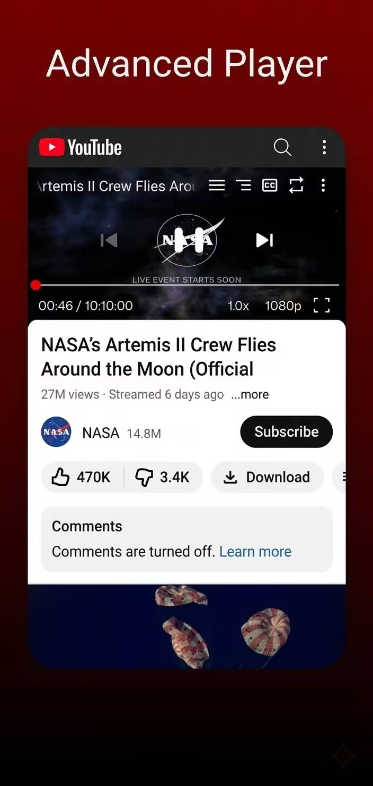
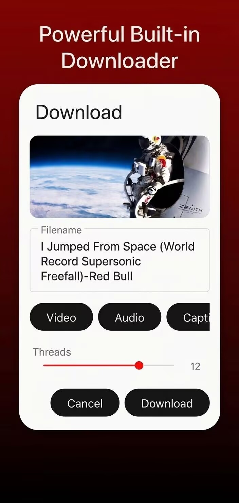
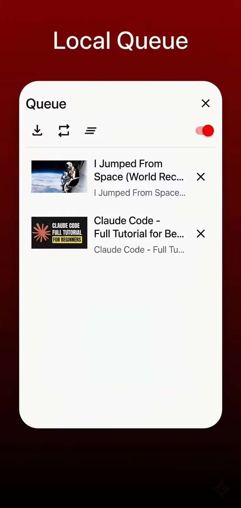

YuTbe
============

by: techniix / cuteLiLi / QuacK

A continuation of the Litube project: https://github.com/HydeYYHH/litube

YuTbe is an advanced webview wrapper for YouTube.

## Features
* [x] **Ad-free playback**
* [x] **Sponsor-block**
* [x] **Mini-player support**
* [x] **Local queue support**
* [x] **Background & Picture-in-Picture support**
* [x] **Built-in video and playlist downloader**
* [x] **Live stream chat support, etc**
* [x] **Toggle on/off grey out watched videos, with user chosen watched %**
* [x] **Local History**

## Future Goals

Security , Reliability , Efficiency 

## Screenshots

## Contributing

If you encounter a bug, please check the GitHub repository to see if an issue has already been reported. If not, feel free to open a new one. Code contributions and pull requests are always welcome!

## License

GPL-3.0. YuTbe is derived from Litube by HydeYYHH (GPL-3.0); this notice is required by the license. NewPipe Extractor is GPL-3.0-or-later.
